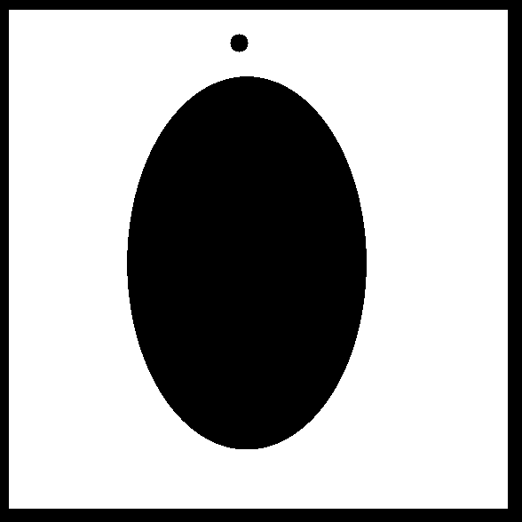
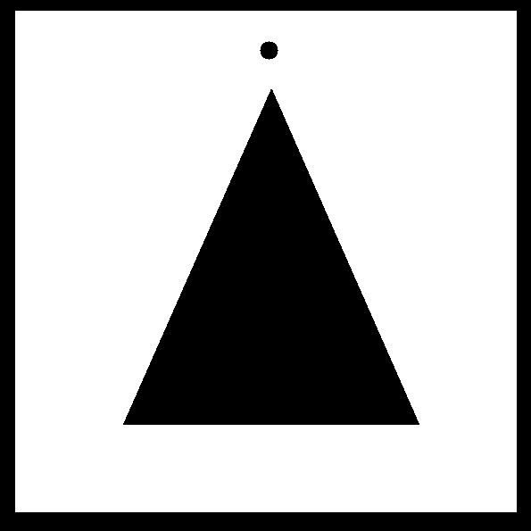

# Path-Planning-via-Morphological-Image-Processing

Using morphological IP methods of thinning, we thin the free region and create a single pixel thin path of free space. This is similar to Voronoi diagrams. Using the path we create a graph and deploy Breadth First Search (BFS) Algorithm to find shortest path between start and goal points.
The following animations show results of path planning.

 / ! 

 / ! 

 / ! 

 / ! 

 / ! 

 / ! 

